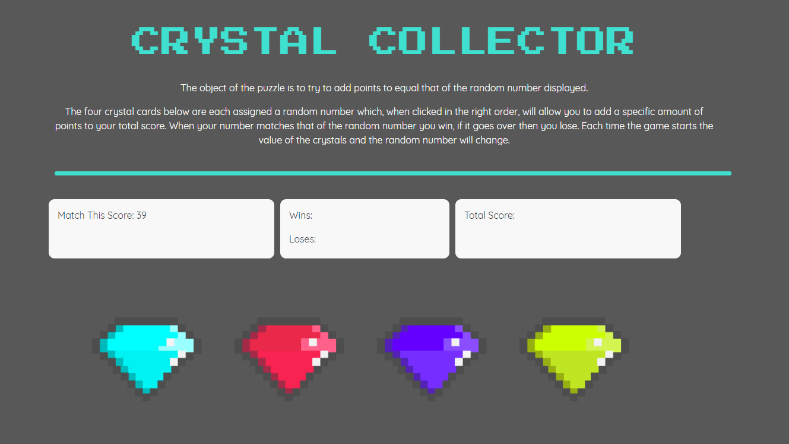
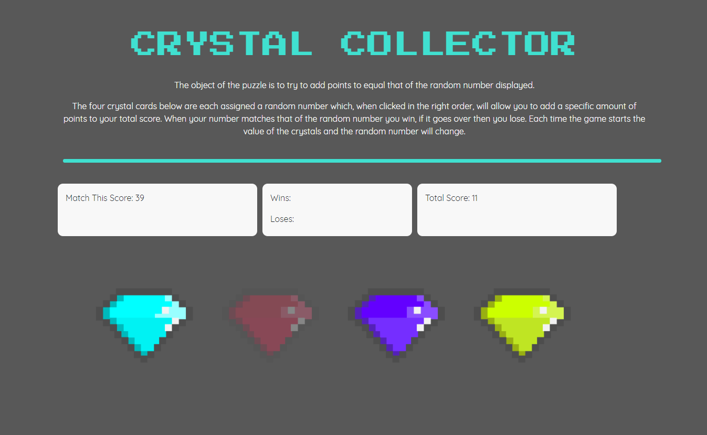
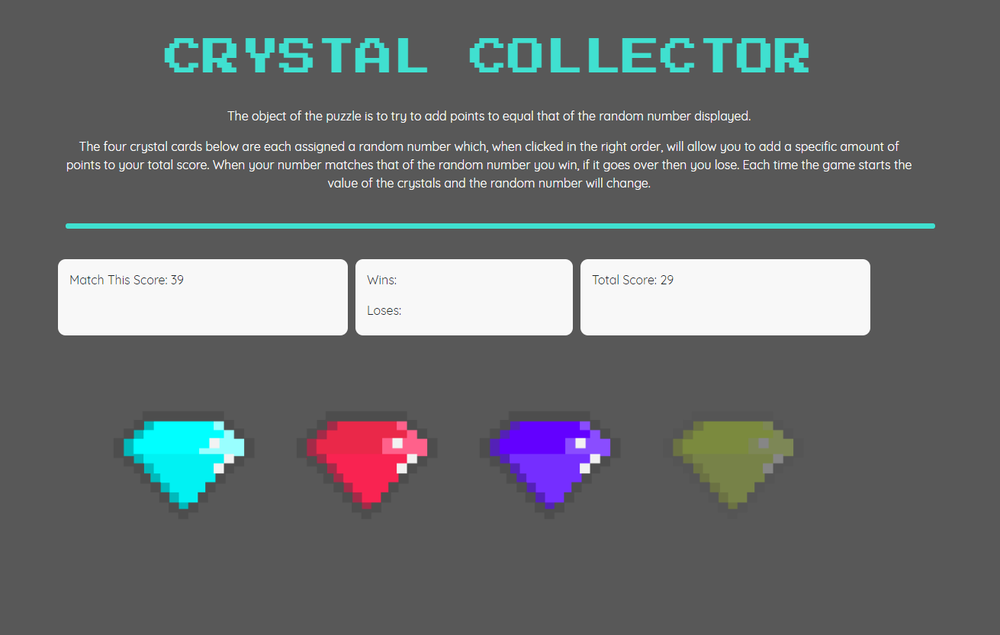
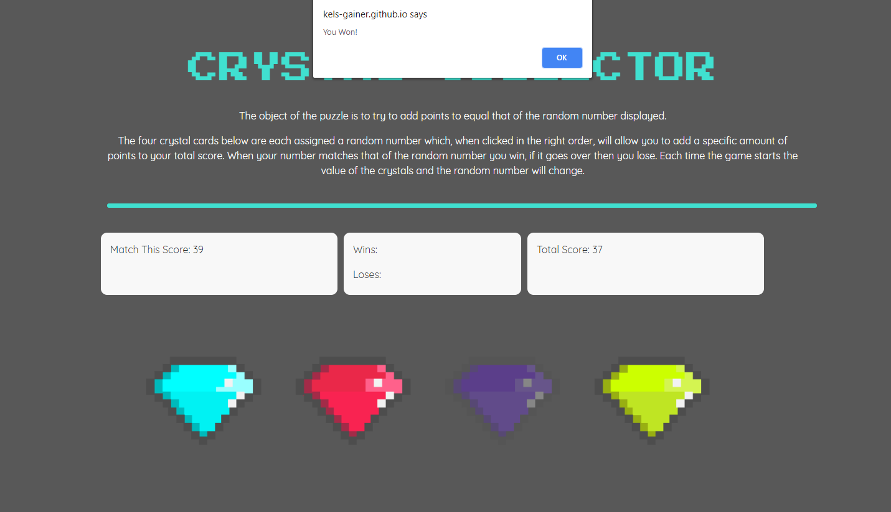
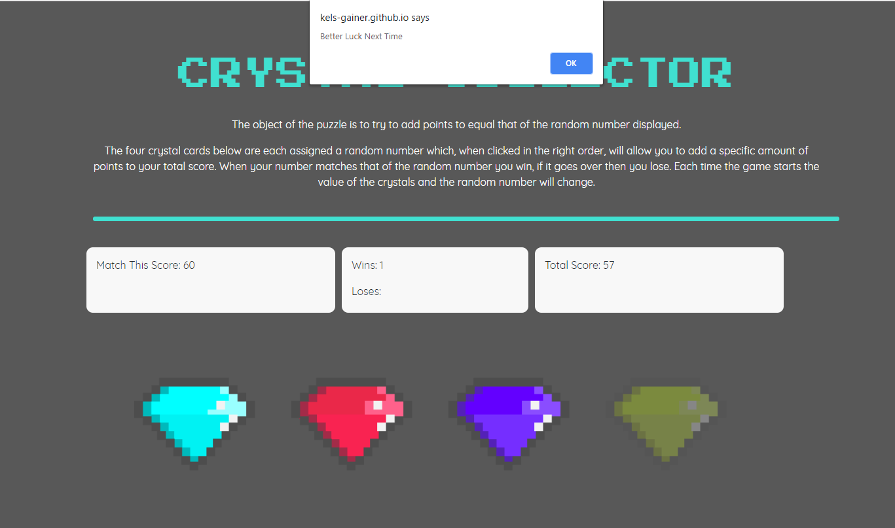
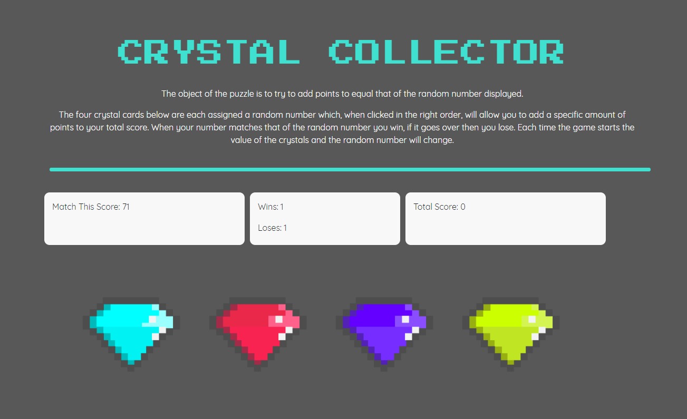

# Crystal-Game

Overview:

Crystal Collector is a game that has the user try to add up a score that the computer has provided by guessing the assigned number that each crystal represents yet, if the player reloads or plays a new game the value of each crystal changes.

On the left is the score the computer generates at the start of each game titled "Match This Score: " 

On the right titled "Total Score: " we can see what the value of the red gem is and when other crystals are clicked see their value added to the score.

If you guess correctly and get the same score as the generated one you will get an alert that lets you know you've won and the opposite if you lose.

Once you hit ok the game will start over with your wins and loses documented.

Tech Used: 

Html
Javascript
Css

